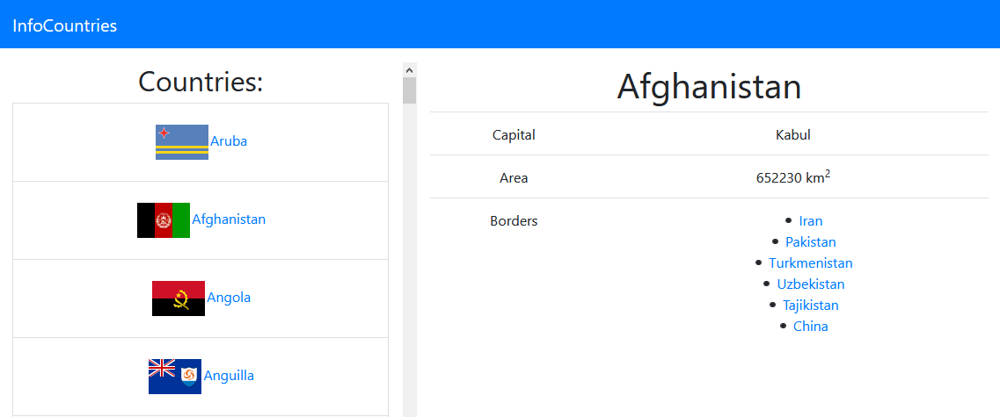

# InfoCountries

## Introduction

React practise using a JSON with countries information [JSON database of countries](https://raw.githubusercontent.com/mledoze/countries/master/countries.json).
Uses Bootstrap 4, Axios, routes and livecycle methods.

 

## Setup
$ npm install
$ npm start